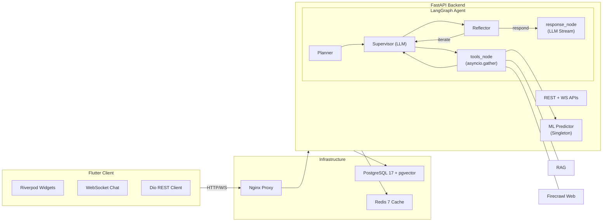

# EduLearn AI

> AI-powered education platform — FastAPI backend with LangGraph agent orchestration + Flutter frontend with Riverpod state management.

## Architecture



## Tech Stack

| Layer | Technology |
|-------|-----------|
| Backend API | [FastAPI](https://fastapi.tiangolo.com/) (async Python) |
| Agent Orchestration | [LangGraph](https://langchain-ai.github.io/langgraph/) |
| ML Inference | TensorFlow + scikit-learn (singleton, load-once) |
| RAG | pgvector + OpenAI embeddings (text-embedding-3-small) |
| LLM | OpenAI-compatible via LangChain (Flaz.id) |
| Database | PostgreSQL 17 + [pgvector](https://github.com/pgvector/pgvector) |
| Cache | Redis 7 (rate limiting, conversation cache) |
| Frontend | Flutter 3.12+ ([Riverpod](https://riverpod.dev/), [go_router](https://gorouter.dev/), [Dio](https://pub.dev/packages/dio)) |
| Package Manager | `uv` (Python) / `pub` (Flutter) |
| Container | Docker + Docker Compose |
| Proxy | Nginx (alpine, with WS upgrade) |

## Repository Structure

```
├── server/             # FastAPI backend (Python)
│   ├── app/            # Application code
│   ├── models/         # ML model files (read-only)
│   └── Dockerfile
│
├── client/             # Flutter frontend (Dart)
│   ├── lib/            # Application code
│   └── pubspec.yaml
│
├── infra/              # Infrastructure
│   ├── docker-compose.yml
│   ├── nginx/          # Reverse proxy config
│   ├── postgres/       # Init scripts
│   └── .env.example    # 116-line env template
│
├── docs/               # Documentation
│   ├── specification/  # 18 spec files (01–18)
│   ├── contract/       # 7 API/WS contract files
│   ├── planning/       # DB & architecture planning
│   ├── progress/       # Real-time progress tracking
│   └── reports/        # Analysis & audit reports
│
└── AGENTS.md           # AI coding agent instructions
```

## Quick Start

```bash
# 1. Clone and configure
cp infra/.env.example infra/.env
# Edit infra/.env with real values

# 2. Start full stack (requires Docker)
docker compose -f infra/docker-compose.yml up --build -d

# 3. Or run locally:

# Backend:
cd server
uv sync
uv run uvicorn app.main:app --reload --host 0.0.0.0 --port 8000

# Frontend (separate terminal):
cd client
flutter pub get
flutter run
```

## Services

| Service | Port | Description |
|---------|------|-------------|
| Nginx | 80 | Reverse proxy + WS upgrade |
| FastAPI | 8000 (internal) | REST API + WebSocket |
| PostgreSQL | 5432 | Primary DB + pgvector |
| Redis | 6379 | Cache + rate limiting |

## Key Features

- **AI Chat**: LangGraph agent with Planner → Supervisor → Tools (parallel) → Reflector → Response reasoning loop
- **Binary Prediction**: TensorFlow model predicts Lulus/Tidak Lulus (binary classification)
- **Knowledge Management**: Upload PDF/DOCX/TXT/MD → chunking → embedding → pgvector search
- **Web Search**: Firecrawl-powered real-time web search during conversations
- **Real-time Streaming**: WebSocket with streaming tokens, tool calls, citations, and state updates
- **Authentication**: JWT access/refresh tokens with RBAC (siswa, pengajar, admin)
- **Analysis Dashboard**: Prediction history, pass rate, strength/improvement recommendations

## Documentation

- `docs/specification/` — Product specifications (18 files, numbered 01–18)
- `docs/contract/` — API & WebSocket contracts (7 files)
- `docs/planning/` — Database schema & architecture planning
- `docs/progress/` — Real-time progress tracking by area
- `docs/reports/` — Analysis & audit reports

## Environment Variables

See `infra/.env.example` (116 lines) for the complete list covering:

- PostgreSQL connection
- Redis connection + password
- LLM provider (Flaz.id) — base URL, API key, model name
- JWT auth — secret, algorithm, expiry
- ML model path + prediction threshold
- WebSocket rate limits + auth
- RAG embedding model, chunk size, overlap, top-K
- Knowledge upload limits + allowed types
- Firecrawl API key + cache TTL
- CORS origins
- Rate limiting window + max requests

## License

<!-- TODO: Add license -->
