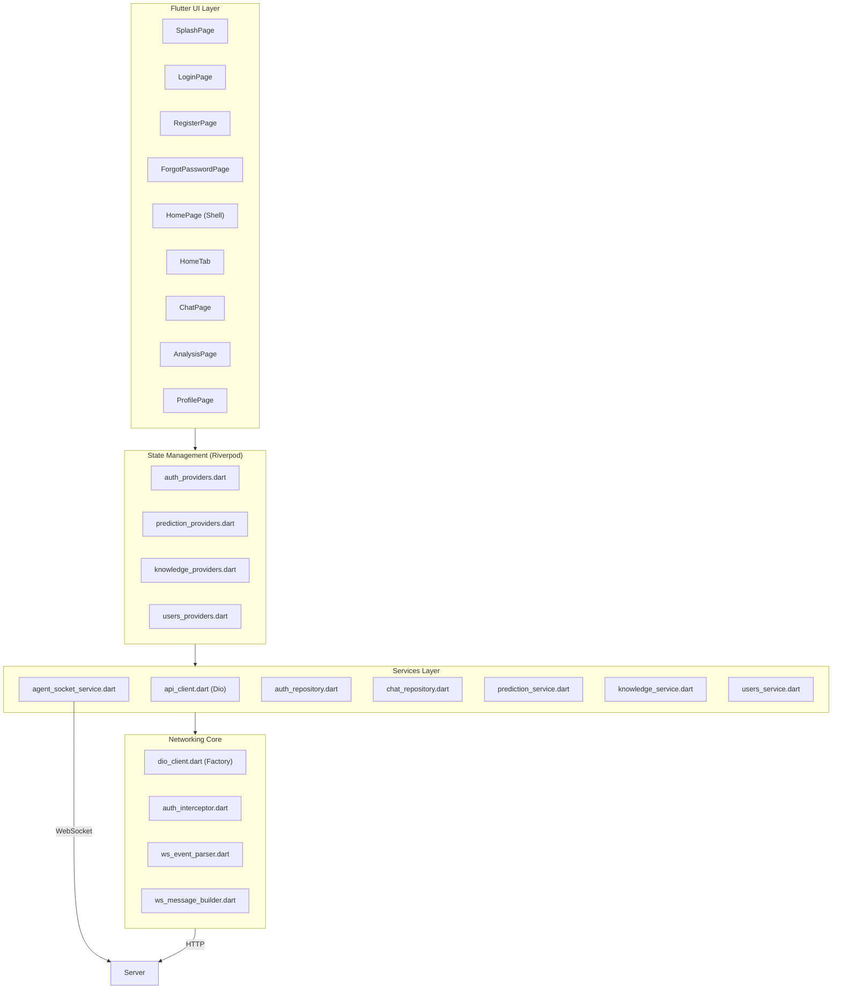

# EduLearn AI — Flutter Client

> Flutter frontend for EduLearn AI education platform with Riverpod state management, go_router navigation, and WebSocket real-time chat.

## Tech Stack

| Layer | Package | Version |
|-------|---------|---------|
| Framework | Flutter SDK | `^3.12.2` |
| State Management | [flutter_riverpod](https://pub.dev/packages/flutter_riverpod) | `^2.6.1` |
| Routing | [go_router](https://pub.dev/packages/go_router) | `^14.2.7` |
| HTTP Client | [Dio](https://pub.dev/packages/dio) | `^5.7.0` |
| Secure Storage | [flutter_secure_storage](https://pub.dev/packages/flutter_secure_storage) | `^9.2.4` |
| Charts | [fl_chart](https://pub.dev/packages/fl_chart) | `^0.70.2` |
| WebSocket | [web_socket_channel](https://pub.dev/packages/web_socket_channel) | `^3.0.1` |
| File Picker | [file_picker](https://pub.dev/packages/file_picker) | `^8.1.2` |
| URL Launcher | [url_launcher](https://pub.dev/packages/url_launcher) | `^6.3.1` |
| Connectivity | [connectivity_plus](https://pub.dev/packages/connectivity_plus) | `^6.1.4` |
| Linting | flutter_lints | `^6.0.0` |

## Architecture



## Routing

| Path | Page | Auth Required |
|------|------|---------------|
| `/` | SplashPage | No |
| `/login` | LoginPage | No |
| `/register` | RegisterPage | No |
| `/forgot-password` | ForgotPasswordPage | No |
| `/home` | HomeTab | Yes |
| `/home/chat` | ChatPage | Yes |
| `/home/analysis` | AnalysisPage | Yes |
| `/home/profile` | ProfilePage | Yes |

Bottom navigation via `StatefulShellRoute.indexedStack` with 4 branches: Home, Chat, Analysis, Profile.

## Project Structure

```
client/lib/
├── core/
│   ├── config/
│   │   └── app_config.dart       # API/WS base URLs from --dart-define
│   ├── models/
│   │   ├── user.dart             # User model (+ initials, roleLabel, isPengajar)
│   │   └── ...                   # Response models
│   ├── network/
│   │   ├── dio_client.dart       # Dio factory (base URL, timeouts, interceptor)
│   │   ├── auth_interceptor.dart # Auto-attach Bearer token + refresh on 401
│   │   ├── ws_event_parser.dart  # WebSocket JSON event → typed event
│   │   └── ws_message_builder.dart # Builder for user_message + pong
│   ├── providers/
│   │   ├── auth_providers.dart   # Auth state, token management
│   │   ├── prediction_providers.dart
│   │   ├── knowledge_providers.dart
│   │   └── users_providers.dart
│   ├── routing/
│   │   ├── app_router.dart       # GoRouter with StatefulShellRoute
│   │   └── app_routes.dart       # Route path constants
│   ├── services/
│   │   ├── api_client.dart       # All REST API calls (auth, users, predictions, knowledge, chat)
│   │   ├── agent_socket_service.dart # WebSocket lifecycle + message handling
│   │   ├── auth_repository.dart  # Login/register/refresh/logout
│   │   ├── chat_repository.dart  # REST chat API
│   │   ├── prediction_service.dart
│   │   ├── knowledge_service.dart
│   │   └── users_service.dart
│   ├── theme/                    # Theme tokens (colors, typography, spacing)
│   └── widgets/                  # Shared widgets
├── features/
│   ├── splash/                   # Splash page (12-splash.md spec)
│   ├── auth/                     # Login, Register, ForgotPassword
│   ├── home/                     # Home tab with greeting + chart + quick actions
│   ├── chat/                     # Full chat (streaming, status, charts, citations, web results)
│   ├── analysis/                 # Binary analysis donut + recommendations
│   ├── profile/                  # Profile + knowledge management
│   └── knowledge/                # Knowledge document list
└── main.dart                     # Entrypoint + ProviderScope
```

## State Management

Riverpod providers for each domain:

- **auth_providers** — `authStateProvider`, `currentUserProvider`, `login`, `register`, `logout`
- **prediction_providers** — `latestPredictionProvider`, `predictionHistoryProvider`, `predictionAnalysisProvider`
- **knowledge_providers** — `knowledgeDocumentsProvider`, `uploadDocument`, `deleteDocument`
- **users_providers** — `userStatsProvider`

## Networking

### REST (Dio)

- Base URL from `dart-define API_BASE_URL` (default `http://10.0.2.2:8000/api/v1`)
- `AuthInterceptor` auto-attaches `Authorization: Bearer <token>` on every request
- On 401 response, attempts token refresh via `/auth/refresh` before retrying
- All API methods in `ApiClient` are sync-style one-liners returning `Future<T>`

### WebSocket

- Base URL from `dart-define WS_BASE_URL` (default `ws://10.0.2.2:8000/ws/v1/chat`)
- `AgentSocketService` manages connection lifecycle with exponential backoff reconnect
- Sends `{"type":"user_message","message":"...","conversation_id":"..."}` format
- Handles `ping` → `pong` heartbeat automatically
- Tracks `conversation_id` across messages
- Fallback to REST chat after 3 failed reconnection attempts
- Connectivity monitoring via `connectivity_plus` for offline detection

#### Event types handled

| Server Event | Dart Model | UI Effect |
|---|---|---|
| `state_update` | `StateUpdateEvent` | Agent status badge (thinking/online) |
| `plan_generated` | `PlanGeneratedEvent` | Agent trace sheet step list |
| `tool_call` | `ToolCallEvent` | Trace log + parallel group indicator |
| `tool_result` | `ToolResultEvent` | Duration + success/failure icon |
| `token` | `TokenEvent` | Streaming text in chat bubble |
| `prediction_result` | `PredictionResultEvent` | Prediction chart card |
| `citation` | `CitationEvent` | Citation tile with metadata |
| `web_search_result` | `WebSearchResultEvent` | Web result tile |
| `reflection` | `ReflectionEvent` | Reflection card with quality score |
| `final` | `FinalEvent` | Finalize message, stop streaming |
| `error` | `AgentErrorEvent` | Error banner in chat bubble |

#### Tag parser

Final answer from `response_node` may include XML-like tags parsed by `ChatBubble` into specialized cards:

| Tag | UI Component |
|-----|-------------|
| `<plan>` | `PlanCard` (execution steps) |
| `<reasoning>` | `ReasoningCard` (AI thinking process) |
| `<action>` | `ActionGroupCard` (parallel tool groups) |
| `<reflection>` | `ReflectionCard` (quality score, missing aspects) |

Unclosed tags during streaming are handled gracefully by the streaming-aware parser.

## Setup

```bash
cd client

# Install dependencies
flutter pub get

# Run with default URLs (Android emulator → host machine)
flutter run

# Run with custom API URL
flutter run --dart-define=API_BASE_URL=http://192.168.1.100:8000/api/v1 \
            --dart-define=WS_BASE_URL=ws://192.168.1.100:8000/ws/v1/chat

# Build APK
flutter build apk --dart-define=API_BASE_URL=<production_url>

# Analyze
dart analyze lib/

# Run tests
flutter test
```

## Testing

```bash
# Run all tests
flutter test

# Run with coverage
flutter test --coverage

# Generate coverage report
genhtml coverage/lcov.info -o coverage/html
```

## Environment Configuration

| Variable | Default | Description |
|----------|---------|-------------|
| `API_BASE_URL` | `http://10.0.2.2:8000/api/v1` | REST API base URL |
| `WS_BASE_URL` | `ws://10.0.2.2:8000/ws/v1/chat` | WebSocket endpoint |

Configured via `--dart-define` flags at build/run time.  
Default `10.0.2.2` is the Android emulator's host loopback.

## Code Style

- Riverpod `ConsumerWidget` / `ConsumerStatefulWidget` for all pages
- `go_router` with `StatefulShellRoute.indexedStack` for bottom nav
- All theme tokens from `core/theme/` — no hardcoded colors/spacing
- Indonesian UI text (semua label dan error messages dalam Bahasa Indonesia)
- SnackBar for error feedback (not dialogs)
- Models with manual `fromJson`/`toJson` in `core/models/`
- No business logic in widgets — isolated in providers/services
- `usePathUrlStrategy()` for clean URL paths (no `#` in routes)

## Flutter Skills

See `client/.agents/skills/` for 10 best-practice skill files covering:

1. Flutter architecture best practices
2. HTTP package usage (Dio patterns)
3. Declarative routing (go_router)
4. JSON serialization (fromJson)
5. Widget testing
6. Responsive layout
7. Layout issue fixing
8. Localization
9. Integration testing / MCP
10. Widget preview (@Preview)

## Pages Overview

- **SplashPage** — Auto-login check, redirects to `/home` or `/login`
- **LoginPage** — Email login with validation, eye toggle, forgot-password link
- **RegisterPage** — Sign up with password strength indicator, 409 conflict handling
- **ForgotPasswordPage** — Password reset form
- **HomeTab** — Greeting + prediction chart + quick action cards
- **ChatPage** — Full AI chat with streaming, status badges, prediction chart, citations, agent trace, web search
- **AnalysisPage** — Donut chart (Lulus/Tidak Lulus), strength cards, improvement cards, progress comparison, history list
- **ProfilePage** — User bio card, stats, knowledge management (upload/delete for pengajar), settings, logout

## Development

```bash
# Watch for changes & hot reload
flutter run -d chrome

# Build for production
flutter build apk --release
flutter build ios --release
flutter build web --release
```
