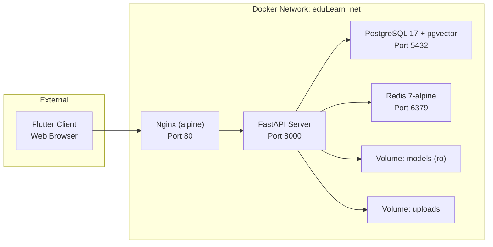

# EduLearn AI — Infrastructure

> Docker Compose orchestration for EduLearn AI platform with Nginx reverse proxy, PostgreSQL + pgvector, Redis cache, and FastAPI server.

## Services



| Service | Image | Healthcheck | Restart |
|---------|-------|-------------|---------|
| `db` | `pgvector/pgvector:pg17` | `pg_isready` (5s interval) | unless-stopped |
| `redis` | `redis:7-alpine` | `redis-cli ping` (5s interval) | unless-stopped |
| `server` | Build from `../server/Dockerfile` | `curl /health` (30s interval) | unless-stopped |
| `nginx` | `nginx:alpine` | — | unless-stopped |

## Docker Compose

```yaml
version: "3.9"
name: eduLearn
services:
  db:      # pgvector/pgvector:pg17
  redis:   # redis:7-alpine
  server:  # build: ../server
  nginx:   # nginx:alpine
volumes:
  eduLearn_pgdata   # PostgreSQL data persistence
  eduLearn_redisdata # Redis data persistence
  eduLearn_uploads  # Knowledge upload storage
networks:
  eduLearn_net      # bridge driver
```

## Volumes

| Volume | Purpose | Mount Point |
|--------|---------|-------------|
| `eduLearn_pgdata` | PostgreSQL data persistence | `/var/lib/postgresql/data` |
| `eduLearn_redisdata` | Redis data persistence | `/data` |
| `eduLearn_uploads` | Knowledge document uploads | `/app/uploads` |
| `../models:/app/models:ro` | ML model files (read-only) | `/app/models` |

## Nginx Configuration

### `default.conf`

- Upstream `fastapi_backend` → `server:8000`
- `client_max_body_size 20M` (for knowledge file uploads)
- Routes:
  - `/api/` → FastAPI (REST endpoints)
  - `/health` → FastAPI (health check)
  - `/` → FastAPI (fallback)
- Standard proxy headers (Host, X-Real-IP, X-Forwarded-For, X-Forwarded-Proto)

### `ws.conf`

- Routes `/ws/` → FastAPI with WebSocket upgrade headers
- `proxy_set_header Upgrade $http_upgrade`
- `proxy_set_header Connection "upgrade"`
- Timeouts: 3600s (1 hour) for long-lived WS connections
- `proxy_buffering off` (required for streaming)

## Environment Variables

### Setup

```bash
cd infra
cp .env.example .env
# Edit .env with real values (API keys, JWT secret, DB passwords)
```

### Variable Groups

| Group | Key Variables | Description |
|-------|---------------|-------------|
| **PostgreSQL** | `POSTGRES_USER`, `POSTGRES_PASSWORD`, `POSTGRES_DB`, `POSTGRES_PORT` | DB credentials |
| **Redis** | `REDIS_PASSWORD`, `REDIS_PORT` | Cache credentials |
| **Server** | `DATABASE_URL`, `REDIS_URL`, `ENVIRONMENT`, `LOG_LEVEL`, `VERSION` | Backend config |
| **Nginx** | `NGINX_PORT` | Proxy port (default: 80) |
| **ML Model** | `MODEL_DIR` | Model artifact directory (default: `/app/models`) |
| **LLM** | `FLAZ_BASE_URL`, `FLAZ_API_KEY`, `LLM_MODEL` | OpenAI-compatible API |
| **JWT Auth** | `JWT_SECRET`, `JWT_ALGORITHM`, `JWT_ACCESS_EXPIRE_MIN`, `JWT_REFRESH_EXPIRE_DAYS` | Token config |
| **Firecrawl** | `FIRECRAWL_API_KEY`, `FIRECRAWL_CACHE_TTL`, `FIRECRAWL_RATE_PER_CONV` | Web search tool |
| **WebSocket** | `WS_HEARTBEAT_INTERVAL`, `WS_AUTH_REQUIRED`, `WS_CONNECTION_LIMIT_PER_USER`, `WS_RATE_MSG_PER_MIN`, `WS_MAX_ITERATIONS` | WS settings + LangGraph loop guard |
| **RAG** | `EMBEDDING_MODEL`, `EMBEDDING_DIM`, `RAG_CHUNK_SIZE`, `RAG_CHUNK_OVERLAP`, `RAG_TOP_K` | RAG pipeline |
| **Upload** | `UPLOAD_MAX_FILE_SIZE_MB`, `UPLOAD_ALLOWED_TYPES`, `UPLOAD_DIR`, `UPLOAD_RATE_PER_DAY` | Knowledge ingestion |
| **Rate Limit** | `RATE_LIMIT_WINDOW_SECONDS`, `RATE_LIMIT_MAX_REQUESTS` | API rate limiting |
| **CORS** | `CORS_ORIGINS` | Allowed origins |
| **Observability** | `METRICS_ENABLED` | Metrics toggle |

> **Note:** `PREDICTION_THRESHOLD` is defined in `.env.example` but not yet consumed by the predictor (hardcoded at 0.5).

## Deployment

### Production

```bash
cd infra

# Copy and configure environment
cp .env.example .env
# Fill in: JWT_SECRET (256-bit random), FLAZ_API_KEY, FIRECRAWL_API_KEY, passwords

# Place ML model files
mkdir -p ../models
# Copy: model.weights.h5, pipeline.joblib, metadata.json, config.json

# Start services
docker compose up --build -d

# Check health
curl http://localhost/health

# View logs
docker compose logs -f server
docker compose logs -f db
```

### Development with hot reload

```bash
cd infra
docker compose -f docker-compose.yml -f docker-compose.override.yml up --build -d
```

The `docker-compose.override.yml` mounts `../server:/app` and enables `--reload` for live code changes. It also exposes PostgreSQL and Redis ports for direct connections.

### Scaling

```bash
docker compose up --scale server=3 -d
```

Nginx automatically load-balances across server instances via the upstream block.

### Stop & Cleanup

```bash
# Stop services
docker compose down

# Stop + remove volumes (WARNING: destroys data)
docker compose down -v

# Rebuild from scratch
docker compose build --no-cache && docker compose up -d
```

## Network

All services communicate over a dedicated bridge network `eduLearn_net`. Inter-service communication uses container names:

- `db:5432` → PostgreSQL
- `redis:6379` → Redis
- `server:8000` → FastAPI

## Dockerfile (server)

Multi-stage build with `uv`:

| Stage | Base Image | Purpose |
|-------|-----------|---------|
| `builder` | `python:3.12-slim` | Install deps, build project |
| `final` | `python:3.14-slim` | Runtime: non-root `appuser`, HEALTHCHECK |

## Resource Limits

| Service | Memory Limit |
|---------|-------------|
| server | 2G |

Configured via `deploy.resources.limits.memory` in docker-compose.

## Security

- ML model volume mounted `:ro` (read-only)
- Server runs as non-root `appuser`
- Nginx proxies all requests — backend ports not exposed to host
- Redis requires password (`REDIS_PASSWORD`)
- PostgreSQL credentials and sensitive config in `.env` (not committed)
- `curl` healthcheck (not wget — aligned with alpine base)
- Rate limiting via Redis sliding window (30 req/min default)

## PostgreSQL Init

`postgres/init.sql` runs on first database startup to create the `pgvector` extension and any required initial schema.

<!-- TODO: Document init.sql contents -->

## Monitoring

```bash
# Check service health
docker compose ps
docker compose logs --tail=50

# Health endpoint
curl http://localhost/health

# Redis ping
docker compose exec redis redis-cli -a "$REDIS_PASSWORD" ping

# PostgreSQL query
docker compose exec db psql -U "$POSTGRES_USER" -d "$POSTGRES_DB" -c "\dt"
```

## Troubleshooting

| Symptom | Likely Cause | Fix |
|---------|-------------|-----|
| Server unhealthy | ML model not loaded | Check `../models/` exists with model files |
| DB connection refused | PostgreSQL not ready | Check `depends_on.condition: service_healthy` |
| WebSocket disconnects | Proxy timeout too low | Check `proxy_read_timeout` in `ws.conf` |
| Upload fails (413) | `client_max_body_size` too small | Increase in `nginx/default.conf` |
| 502 Bad Gateway | Server crashed or not started | Check `docker compose logs server` |
