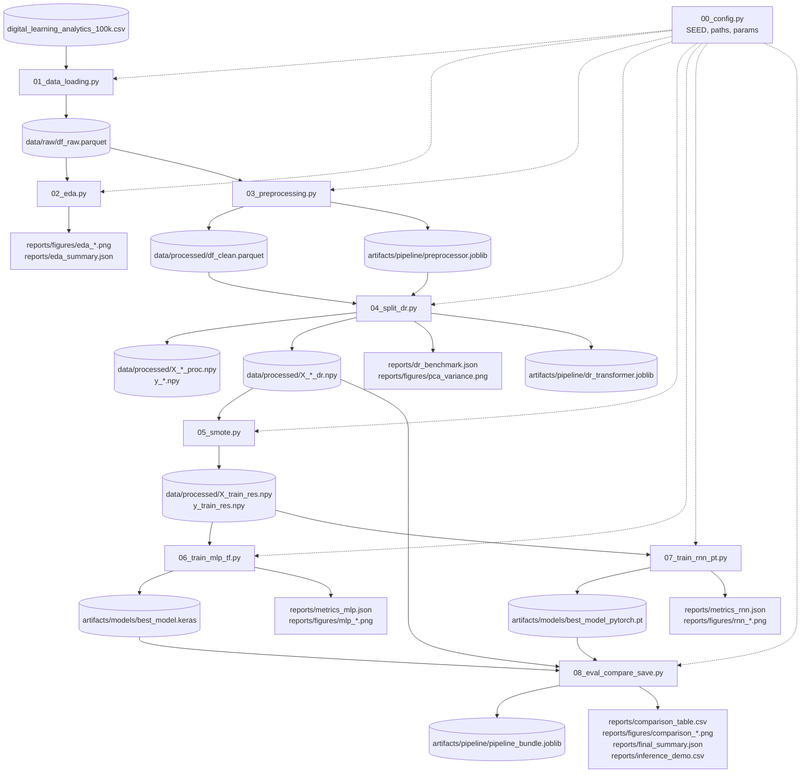

# PLAN RISET — End-to-End Deep Learning Pipeline
## AI-Powered Adaptive Learning Recommender (Pemecahan `ml-prak-uas.ipynb`)

> **Goal Riset:** Membangun sistem klasifikasi `course_completed` (Lulus / Tidak Lulus) pada dataset `digital_learning_analytics_100k.csv` (100.000 baris × 43 kolom) menggunakan pipeline Deep Learning end-to-end, dengan membandingkan dua arsitektur (Deep MLP TensorFlow vs RNN PyTorch) lalu menyimpan model terbaik untuk deployment.

Dokumen ini memecah **satu notebook panjang (`ml-prak-uas.ipynb`, 43 cells, 14 section)** menjadi **8 modul riset coarse + 1 file config + 1 master orchestrator notebook**. Tiap modul menghasilkan artifact (df / pipeline / model) yang menjadi input modul berikutnya — sehingga pipeline bisa di-pause, di-inspect, dan di-rerun per tahap tanpa harus dari awal.

---

## Daftar Isi

1. [Pemetaan Notebook → Modul](#1-pemetaan-notebook--modul)
2. [Struktur Folder (Nested)](#2-struktur-folder-nested)
3. [Diagram Alur Data](#3-diagram-alur-data)
4. [Kontrak IO Antar-modul](#4-kontrak-io-antar-modul)
5. [Detail per Modul](#5-detail-per-modul)
   - [00_config.py](#00_configpy)
   - [01_data_loading.py](#01_data_loadingpy)
   - [02_eda.py](#02_edapy)
   - [03_preprocessing.py](#03_preprocessingpy)
   - [04_split_dr.py](#04_split_drpy)
   - [05_smote.py](#05_smotepy)
   - [06_train_mlp_tf.py](#06_train_mlp_tfpy)
   - [07_train_rnn_pt.py](#07_train_rnn_ptpy)
   - [08_eval_compare_save.py](#08_eval_compare_savepy)
   - [master_pipeline.ipynb](#master_pipelineipynb)
6. [Cara Menjalankan](#6-cara-menjalankan)
7. [Catatan Reproducibility & Environment](#7-catatan-reproducibility--environment)

---

## 1. Pemetaan Notebook → Modul

Tabel berikut memetakan setiap section di `ml-prak-uas.ipynb` ke modul file tujuannya. Cell number mengacu pada urutan cell di notebook asli.

| Section Notebook (cell) | Aktivitas | Modul Tujuan | Output Utama |
|---|---|---|---|
| §1 Import (cell 2–3) | Import semua library + seed | `00_config.py` | constants, paths, SEED |
| §2 Data Loading (cell 4–5) | Load CSV, info, describe | `01_data_loading.py` | `df_raw.parquet` |
| §3 EDA (cell 6–7) | Missing, target dist, outlier scan | `02_eda.py` | figures + `eda_summary.json` |
| §4 Data Cleaning (cell 8–10) | Drop cols, dedup, IQR clip | `03_preprocessing.py` | `df_clean.parquet` |
| §5 Feature Transform (cell 11–12) | Ordinal + OneHot + Impute + Scale pipeline | `03_preprocessing.py` | `preprocessor.joblib` |
| §6 Data Splitting (cell 13–14) | 80:10:10 + fit/transform | `04_split_dr.py` | `X_{train,val,test}_proc.npy` |
| §7 Dimensionality Reduction (cell 15–19) | PCA, LDA, PCA+LDA, Autoencoder, benchmark | `04_split_dr.py` | `X_{train,val,test}_dr.npy` + `dr_benchmark.json` |
| §8 SMOTETomek (cell 20–21) | Balance train set | `05_smote.py` | `X_train_res.npy`, `y_train_res.npy` |
| §9 Deep MLP TF (cell 22–25) | Build + fit + evaluate | `06_train_mlp_tf.py` | `best_model.keras` + `metrics_mlp.json` |
| §10 RNN PyTorch (cell 26–30) | Reshape seq + build + fit + evaluate | `07_train_rnn_pt.py` | `best_model_pytorch.pt` + `metrics_rnn.json` |
| §11 Comparison & Viz (cell 31–36) | Tabel, history, CM, bar, radar | `08_eval_compare_save.py` | figures + `comparison_table.csv` |
| §12 Save Best Model (cell 37–39) | Save .keras + .pt + pipeline bundle | `08_eval_compare_save.py` | `pipeline_bundle.joblib` |
| §13 Inference Test (cell 40–41) | Prediksi 10 sampel acak | `08_eval_compare_save.py` | printed demo + `inference_demo.csv` |
| §14 Ringkasan (cell 42–43) | Print summary | `08_eval_compare_save.py` | `final_summary.json` |

**Catatan penggabungan:** Section §4 (cleaning) dan §5 (feature transform) digabung ke `03_preprocessing.py` karena keduanya menghasilkan satu artifact preprocessor yang sama. Section §6 (split) dan §7 (DR) digabung ke `04_split_dr.py` karena DR butuh data split dulu dan output akhirnya adalah satu set array yang sama. Section §11–§14 digabung ke `08_eval_compare_save.py` karena semuanya operasi pasca-training yang membaca hasil 06 & 07.

---

## 2. Struktur Folder (Nested)

Direkomendasikan ditaruh di bawah `riset/` di repo `eduLearn` Anda. Semua path di dokumen ini bersifat **relatif terhadap `riset/`**.

```
eduLearn/
├── AGENTS.md
├── client/
├── docs/
├── server/
└── riset/                              ← SEMUA FILE RISET DI SINI
    │
    ├── PLAN_RISET.md                   ← dokumen ini (panduan)
    │
    │  ── KODE MODUL (hybrid: .py + .ipynb) ──
    ├── 00_config.py                    ← konstanta, paths, seed (dipakai semua modul)
    ├── 01_data_loading.py
    ├── 02_eda.py
    ├── 03_preprocessing.py
    ├── 04_split_dr.py
    ├── 05_smote.py
    ├── 06_train_mlp_tf.py
    ├── 07_train_rnn_pt.py
    ├── 08_eval_compare_save.py
    ├── master_pipeline.ipynb           ← orchestrator: import & run 01–08 berurutan
    │
    │  ── DATA ──
    ├── data/
    │   ├── raw/                        ← dataset asli + snapshot
    │   │   ├── digital_learning_analytics_100k.csv  (input eksternal)
    │   │   └── df_raw.parquet          (snapshot hasil 01)
    │   └── processed/                  ← hasil transformasi antar-modul
    │       ├── df_clean.parquet        (hasil 03)
    │       ├── X_train_proc.npy        (hasil 04, sebelum DR)
    │       ├── X_val_proc.npy
    │       ├── X_test_proc.npy
    │       ├── y_train.npy
    │       ├── y_val.npy
    │       ├── y_test.npy
    │       ├── X_train_dr.npy          (hasil 04, setelah DR terbaik)
    │       ├── X_val_dr.npy
    │       ├── X_test_dr.npy
    │       ├── X_train_res.npy         (hasil 05, setelah SMOTE)
    │       └── y_train_res.npy
    │
    │  ── ARTIFACTS (pipeline & model) ──
    ├── artifacts/
    │   ├── pipeline/
    │   │   ├── preprocessor.joblib     (ColumnTransformer fitted, hasil 03)
    │   │   ├── dr_transformer.joblib   (PCA/LDA/AE terpilih, hasil 04)
    │   │   └── pipeline_bundle.joblib  (bundle lengkap untuk deploy, hasil 08)
    │   └── models/
    │       ├── best_model.keras        (Deep MLP TensorFlow, hasil 06)
    │       └── best_model_pytorch.pt   (RNN PyTorch, hasil 07)
    │
    │  ── REPORTS (figures + metrics) ──
    └── reports/
        ├── eda_summary.json            (hasil 02)
        ├── dr_benchmark.json           (hasil 04)
        ├── metrics_mlp.json            (hasil 06)
        ├── metrics_rnn.json            (hasil 07)
        ├── comparison_table.csv        (hasil 08)
        ├── inference_demo.csv          (hasil 08)
        ├── final_summary.json          (hasil 08)
        └── figures/
            ├── eda_missing.png         (hasil 02)
            ├── eda_target_dist.png
            ├── eda_outliers.png
            ├── pca_variance.png        (hasil 04)
            ├── mlp_training_history.png (hasil 06)
            ├── mlp_confusion_matrix.png
            ├── rnn_training_history.png (hasil 07)
            ├── rnn_confusion_matrix.png
            ├── comparison_bar.png      (hasil 08)
            ├── comparison_radar.png
            └── comparison_cm.png
```

**Konvensi penamaan:**
- File kode: `NN_nama_modul.py` (NN = 2-digit urutan eksekusi)
- Array numpy: `X_<split>_<stage>.npy` (split = train/val/test, stage = proc/dr/res)
- Model: `best_model.<ext>` (ext = `.keras` / `.pt`)
- Metrics: `metrics_<model>.json`
- Figures: `<modul>_<jenis>.png`

---

## 3. Diagram Alur Data



**Inti alur (ringkas):**
```
raw CSV → df_raw → df_clean + preprocessor
                      ↓
                 split 80:10:10 + DR benchmark
                      ↓
                 X_*_dr  →  SMOTE  →  X_train_res
                                            ↓
                            ┌───────────────┴───────────────┐
                            ↓                               ↓
                     Deep MLP (TF)                   RNN (PyTorch)
                            ↓                               ↓
                       best_model.keras              best_model_pytorch.pt
                            └───────────────┬───────────────┘
                                            ↓
                          compare + save bundle + inference + summary
```

---

## 4. Kontrak IO Antar-modul

Tabel ringkas ini adalah **single source of truth** untuk dependency antar-modul. Modul ** tidak boleh** membaca output modul yang tidak tercantum di kolom "Input dari".

| Modul | Input dari | Output Utama | Dikonsumsi oleh |
|---|---|---|---|
| `00_config.py` | — | constants `SEED`, `PATHS`, `PARAMS` | semua modul |
| `01_data_loading.py` | raw CSV (eksternal) | `data/raw/df_raw.parquet` | 02, 03 |
| `02_eda.py` | `df_raw.parquet` | `reports/figures/eda_*.png`, `reports/eda_summary.json` | — (terminal) |
| `03_preprocessing.py` | `df_raw.parquet` | `data/processed/df_clean.parquet`, `artifacts/pipeline/preprocessor.joblib` | 04 |
| `04_split_dr.py` | `df_clean.parquet`, `preprocessor.joblib` | `X_*_proc.npy`, `y_*.npy`, `X_*_dr.npy`, `dr_transformer.joblib`, `dr_benchmark.json` | 05, 06, 07, 08 |
| `05_smote.py` | `X_train_dr.npy`, `y_train.npy` | `X_train_res.npy`, `y_train_res.npy` | 06, 07 |
| `06_train_mlp_tf.py` | `X_train_res`, `y_train_res`, `X_val_dr`, `y_val`, `X_test_dr`, `y_test` | `best_model.keras`, `metrics_mlp.json`, figures | 08 |
| `07_train_rnn_pt.py` | sama dengan 06 | `best_model_pytorch.pt`, `metrics_rnn.json`, figures | 08 |
| `08_eval_compare_save.py` | `metrics_mlp.json`, `metrics_rnn.json`, `X_test_dr`, `y_test`, kedua model, `preprocessor.joblib`, `dr_transformer.joblib` | `pipeline_bundle.joblib`, `comparison_table.csv`, `final_summary.json`, figures, `inference_demo.csv` | — (terminal) |

**Aturan kontrak:**
1. Modul hanya boleh membaca dari path yang tercantum — tidak boleh hardcode path lain.
2. Format file: parquet untuk DataFrame, `.npy` untuk array numpy, `.joblib` untuk object sklearn, `.keras`/`.pt` untuk model.
3. Setiap modul harus bisa dijalankan berulang (idempoten) — jika output sudah ada dan input tidak berubah, modul boleh skip.
4. Setiap modul mencetak **ringkasan artifact** di akhir eksekusi (path + shape + ukuran file).

---

## 5. Detail per Modul

> Format per modul: **Tujuan → Input → Output → Dependensi → Langkah → Expected Output → Mapping ke notebook asli.**

---

### `00_config.py`

**Tujuan:** Satu file konfigurasi global yang diimpor semua modul. Menjamin reproducibility & path consistency.

**Input:** — (file statis)

**Output (ke memory):**
- `SEED = 42`
- `PATHS` — dict berisi semua path relatif terhadap `riset/` (raw, processed, artifacts, reports)
- `PARAMS` — dict berisi hyperparameter (test_size, seq_len, ae_latent, epochs, batch_size, patience, dll.)
- `DROP_COLS` — list kolom yang didrop (ID, tanggal, leakage)
- `ORDINAL_MAP` — dict mapping kolom ordinal → urutan kategori
- `TARGET_COL = 'course_completed'`
- Fungsi `setup_env()` — set seed numpy/tf/torch, buat semua folder, suppress warnings

**Dependensi:** `os`, `numpy`, `pathlib`, `warnings`

**Langkah:**
1. Definisikan `SEED`, `TARGET_COL`, `DROP_COLS`, `ORDINAL_MAP`.
2. Definisikan `PATHS` dict dengan key `raw`, `processed`, `pipeline`, `models`, `reports`, `figures`.
3. Definisikan `PARAMS` dict (split ratio, epochs, batch_size, patience, seq_len, ae_latent).
4. Fungsi `setup_env()` buat folder jika belum ada, set random seed numpy + (opsional) TF/PyTorch, suppress warnings.
5. Export lewat `__all__`.

**Expected Output:** file `00_config.py` yang bisa di-`from config import SEED, PATHS, PARAMS, setup_env`.

**Mapping notebook:** cell 3 (import + seed) + bagian konstanta di cell 5, 9, 12, 16, 27.

---

### `01_data_loading.py`

**Tujuan:** Memuat dataset mentah dari CSV, validasi shape dasar, simpan snapshot parquet untuk reproducibility.

**Input:**
- `data/raw/digital_learning_analytics_100k.csv` (sumber eksternal, harus sudah di-place sebelum run)

**Output:**
- `data/raw/df_raw.parquet` (snapshot)
- `reports/data_info.json` — shape, columns, dtypes, memory usage

**Dependensi:** `00_config.py`, `pandas`, `pyarrow`

**Langkah:**
1. Import `PATHS, SEED, setup_env` dari `00_config`.
2. `setup_env()` — pastikan folder ada.
3. `df = pd.read_csv(PATHS['raw'] / 'digital_learning_analytics_100k.csv')`.
4. Validasi: assert `df.shape[0] >= 100_000` dan `'course_completed' in df.columns`.
5. Print: shape, 5 baris pertama, info dtype, describe().T.
6. Simpan `df.to_parquet(PATHS['raw'] / 'df_raw.parquet', index=False)`.
7. Simpan metadata ke `reports/data_info.json` (shape, columns, dtypes, memory_mb).

**Expected Output:**
- `df_raw.parquet` (~file size sesuai dataset, format parquet lebih kecil dari CSV)
- Log print: `Dataset: 100,000 baris × 43 kolom`

**Mapping notebook:** §2 (cell 4–5).

---

### `02_eda.py`

**Tujuan:** Eksplorasi data sebelum preprocessing — identifikasi missing, distribusi target, outlier, korelasi. Hasil disimpan sebagai figures + JSON summary untuk laporan.

**Input:**
- `data/raw/df_raw.parquet` (dari modul 01)

**Output:**
- `reports/figures/eda_missing.png` — heatmap missing value
- `reports/figures/eda_target_dist.png` — bar chart distribusi `course_completed`
- `reports/figures/eda_outliers.png` — boxplot kolom numerik top-N
- `reports/figures/eda_corr_heatmap.png` — korelasi fitur numerik
- `reports/eda_summary.json` — {missing_count, missing_pct, target_distribution, imbalance_ratio, outlier_counts_per_col}

**Dependensi:** `00_config.py`, `pandas`, `matplotlib`, `seaborn` (opsional)

**Langkah:**
1. Load `df_raw.parquet`.
2. Hitung missing value per kolom → simpan ke dict, plot heatmap.
3. Hitung distribusi `course_completed` + imbalance ratio → plot bar chart.
4. Identifikasi kolom numerik, hitung IQR outlier count per kolom → plot boxplot top-10.
5. Hitung correlation matrix kolom numerik → plot heatmap.
6. Simpan semua figure ke `reports/figures/eda_*.png`.
7. Simpan ringkasan ke `reports/eda_summary.json`.

**Expected Output:**
- 4 file PNG di `reports/figures/`
- `eda_summary.json` berisi angka kunci untuk di-cite di laporan

**Mapping notebook:** §3 (cell 6–7).

---

### `03_preprocessing.py`

**Tujuan:** Data cleaning (drop kolom leakage + dedup + IQR clip) + membangun & fit `ColumnTransformer` (Ordinal + OneHot + Impute + Scale) pada data train. **Catatan:** fit dilakukan setelah split internal, tapi untuk menyederhanakan kontrak, modul ini melakukan split mini internal (80:20 stratified) hanya untuk fit preprocessor — modul 04 akan melakukan split final 80:10:10 dan reuse preprocessor yang sudah di-fit.

> **Alternatif (lebih clean):** pindahkan fitting preprocessor ke modul 04 setelah split final. Pilih salah satu saat implement. Dokumen ini menggunakan pendekatan **preprocessor di-fit di modul 03 menggunakan split 80:20 internal** untuk menjaga kontrak IO tetap sederhana (modul 03 menghasilkan preprocessor.joblib siap pakai).

**Input:**
- `data/raw/df_raw.parquet`

**Output:**
- `data/processed/df_clean.parquet` — DataFrame setelah cleaning (belum di-encode, untuk inspection)
- `artifacts/pipeline/preprocessor.joblib` — fitted `ColumnTransformer`
- `reports/preprocessing_report.json` — {dropped_cols, n_duplicates_removed, outlier_clipped_cols, n_features_before, n_features_after_encode}

**Dependensi:** `00_config.py`, `pandas`, `sklearn.pipeline.Pipeline`, `sklearn.compose.ColumnTransformer`, `SimpleImputer`, `StandardScaler`, `OrdinalEncoder`, `OneHotEncoder`, `joblib`

**Langkah:**
1. Load `df_raw.parquet`.
2. **Cleaning:**
   - Drop `DROP_COLS` (ID, tanggal, leakage).
   - `drop_duplicates().reset_index(drop=True)`.
   - Identifikasi `num_cols`, `ordinal_cols`, `nominal_cols` berdasarkan dtype + `ORDINAL_MAP`.
   - IQR clipping pada `num_cols` (Q1−1.5·IQR, Q3+1.5·IQR).
3. Simpan `df_clean.parquet` (DataFrame bersih, pre-encoding).
4. **Build pipeline per tipe kolom:**
   - `num_pipeline`: SimpleImputer(median) → StandardScaler
   - `ordinal_pipeline`: SimpleImputer(most_frequent) → OrdinalEncoder(categories=ordinal_map) → StandardScaler
   - `nominal_pipeline`: SimpleImputer(most_frequent) → OneHotEncoder(handle_unknown='ignore')
5. Gabung jadi `ColumnTransformer` → fit pada `df_clean.drop(columns=[TARGET_COL])`.
6. Simpan `preprocessor.joblib` lewat `joblib.dump`.
7. Simpan `preprocessing_report.json` (shape before/after, n features output).

**Expected Output:**
- `df_clean.parquet` — baris sedikit berkurang (dedup) dari 100k
- `preprocessor.joblib` — object sklearn siap transform
- `n_features_after_encode` (akan jadi input DR di modul 04)

**Mapping notebook:** §4 + §5 (cell 8–12).

---

### `04_split_dr.py`

**Tujuan:** Split final 80:10:10, transform dengan preprocessor, lalu benchmark 4 teknik DR (PCA, LDA, PCA+LDA, Autoencoder) dan pilih terbaik berdasarkan F1 Logistic Regression. Output: array numpy DR-transformed untuk train/val/test.

**Input:**
- `data/processed/df_clean.parquet`
- `artifacts/pipeline/preprocessor.joblib`

**Output:**
- `data/processed/X_train_proc.npy`, `X_val_proc.npy`, `X_test_proc.npy` (sebelum DR, untuk debugging)
- `data/processed/y_train.npy`, `y_val.npy`, `y_test.npy`
- `data/processed/X_train_dr.npy`, `X_val_dr.npy`, `X_test_dr.npy` (hasil DR terbaik)
- `artifacts/pipeline/dr_transformer.joblib` — object DR terpilih (PCA / LDA / AE encoder)
- `reports/dr_benchmark.json` — {technique: {f1, dim}, best_technique, n_components}
- `reports/figures/pca_variance.png` — cumulative variance plot

**Dependensi:** `00_config.py`, `pandas`, `numpy`, `sklearn.model_selection.train_test_split`, `sklearn.decomposition.PCA`, `sklearn.discriminant_analysis.LinearDiscriminantAnalysis`, `sklearn.linear_model.LogisticRegression`, `sklearn.metrics.f1_score`, `torch` (untuk autoencoder), `joblib`

**Langkah:**
1. Load `df_clean.parquet` + `preprocessor.joblib`.
2. Split `X = df.drop(TARGET_COL)`, `y = df[TARGET_COL].values`.
3. `X_train, X_tmp, y_train, y_tmp = train_test_split(X, y, test_size=0.20, stratify=y, random_state=SEED)`.
4. `X_val, X_test, y_val, y_test = train_test_split(X_tmp, y_tmp, test_size=0.50, stratify=y_tmp, random_state=SEED)`.
5. Transform: `X_train_proc = preprocessor.fit_transform(X_train)` (refit di train final), `X_val_proc = preprocessor.transform(X_val)`, `X_test_proc = preprocessor.transform(X_test)`.
   > **Catatan:** preprocessor di-refit di sini pada train final 80% untuk hindari data leakage dari fit di modul 03. Update `preprocessor.joblib` dengan versi final.
6. Simpan semua array `.npy` (proc + y).
7. **PCA:** fit PCA full → cari `n_pca` minimum untuk 95% varians (min 10) → fit & transform. Plot cumulative variance → `pca_variance.png`.
8. **LDA:** `LDA(n_components=1).fit_transform(X_train_proc, y_train)`.
9. **PCA+LDA:** `np.hstack([X_train_pca, X_train_lda])`.
10. **Autoencoder (PyTorch):** encoder `input_dim → 256 → 128 → latent_dim (min(25, n//3))`, train dengan MSE reconstruction loss pada `X_train_proc` (epochs ~30, batch 256), gunakan `encoder` saja untuk transform.
11. **Benchmark:** untuk setiap teknik DR, fit `LogisticRegression(max_iter=500)` pada `X_train_*_dr`, predict `X_test_*_dr`, hitung F1.
12. Pilih `BEST_DR = max(f1)`. Set `X_{train,val,test}_dr` ke hasil teknik terbaik.
13. Simpan `dr_transformer.joblib` (PCA / LDA / AE state_dict — tergantung pemenang).
14. Simpan semua `X_*_dr.npy`.
15. Simpan `dr_benchmark.json` {per technique: f1, dim, best_technique}.

**Expected Output:**
- Print benchmark: `PCA: F1=0.xxxx (dim=NN) | LDA: F1=0.xxxx (dim=1) | PCA+LDA: ... | Autoencoder: ...`
- Print: `>>> BEST DR: <technique> (F1=0.xxxx)`
- 8 file `.npy` di `data/processed/`

**Mapping notebook:** §6 + §7 (cell 13–19).

---

### `05_smote.py`

**Tujuan:** Handle class imbalance pada train set (setelah DR) menggunakan SMOTETomek. Val & test tetap original (tidak di-resample) untuk evaluasi yang fair.

**Input:**
- `data/processed/X_train_dr.npy`
- `data/processed/y_train.npy`

**Output:**
- `data/processed/X_train_res.npy`
- `data/processed/y_train_res.npy`
- `reports/smote_report.json` — {before: {class_0, class_1}, after: {class_0, class_1}, technique: 'SMOTETomek'}

**Dependensi:** `00_config.py`, `numpy`, `imblearn.combine.SMOTETomek`

**Langkah:**
1. Load `X_train_dr.npy` + `y_train.npy`.
2. Print distribusi sebelum.
3. `smote = SMOTETomek(random_state=SEED)`.
4. `X_train_res, y_train_res = smote.fit_resample(X_train_dr, y_train)`.
5. Print distribusi sesudah.
6. Simpan kedua array `.npy`.
7. Simpan `smote_report.json`.

**Expected Output:**
- Print: `Sebelum — Class 0=NN,NNN | Class 1=NN,NNN` → `Sesudah — Class 0=NN,NNN | Class 1=NN,NNN` (balanced)
- `X_train_res` shape: `(N_balanced, n_dr_components)`

**Mapping notebook:** §8 (cell 20–21).

---

### `06_train_mlp_tf.py`

**Tujuan:** Bangun, training, dan evaluasi Deep MLP (TensorFlow/Keras) dengan regularisasi lengkap. Simpan model `.keras` + metrics + figures.

**Input:**
- `data/processed/X_train_res.npy`, `y_train_res.npy` (train, balanced)
- `data/processed/X_val_dr.npy`, `y_val.npy` (validation)
- `data/processed/X_test_dr.npy`, `y_test.npy` (test, untuk evaluasi akhir)

**Output:**
- `artifacts/models/best_model.keras`
- `reports/metrics_mlp.json` — {accuracy, precision, recall, f1, auc_roc, training_time_sec, epochs_run, best_epoch}
- `reports/figures/mlp_training_history.png` — loss + accuracy curve (train vs val)
- `reports/figures/mlp_confusion_matrix.png`

**Dependensi:** `00_config.py`, `numpy`, `tensorflow.keras` (Sequential, Dense, BatchNorm, Dropout, Input, callbacks), `sklearn.metrics`

**Langkah:**
1. Load semua array `.npy`.
2. Set `INPUT_DIM = X_train_res.shape[1]`.
3. Compute `class_weight` dari distribusi `y_train_res`.
4. Build `Sequential`:
   - `Input(INPUT_DIM)`
   - 3× `[Dense(256/128/64, kernel_regularizer=l2(1e-4)) → BatchNorm → ReLU → Dropout(0.3/0.2/0.1)]`
   - `Dense(1, sigmoid)`
5. Compile: `optimizer=Adam(1e-3)`, `loss=binary_crossentropy`, `metrics=[accuracy, Precision, Recall, AUC]`.
6. Callbacks: `EarlyStopping(monitor='val_loss', patience=12, restore_best_weights=True)`, `ReduceLROnPlateau(factor=0.5, patience=6, min_lr=1e-6)`.
7. `model.fit(X_train_res, y_train_res, validation_data=(X_val_dr, y_val), epochs=100, batch_size=256, class_weight=..., callbacks=...)`.
8. Evaluate pada `X_test_dr`: hitung accuracy, precision, recall, F1, AUC-ROC, confusion matrix.
9. Simpan model: `model.save(PATHS['models'] / 'best_model.keras')`.
10. Plot training history (loss + accuracy) → `mlp_training_history.png`.
11. Plot confusion matrix → `mlp_confusion_matrix.png`.
12. Simpan `metrics_mlp.json`.

**Expected Output:**
- Print training progress per epoch (verbose=1).
- Print final: `Accuracy | Precision | Recall | F1 | AUC | Waktu`.
- Target F1 ≥ 0.75 (tergantung dataset).

**Mapping notebook:** §9 (cell 22–25).

---

### `07_train_rnn_pt.py`

**Tujuan:** Bangun, training, dan evaluasi RNN (PyTorch) pada data tabular yang di-reshape ke format sequential. Simpan model `.pt` + metrics + figures.

**Input:**
- `data/processed/X_train_res.npy`, `y_train_res.npy`
- `data/processed/X_val_dr.npy`, `y_val.npy`
- `data/processed/X_test_dr.npy`, `y_test.npy`
- `INPUT_DIM` (dari shape array) dan `SEQ_LEN = 5` (dari `PARAMS`)

**Output:**
- `artifacts/models/best_model_pytorch.pt` — checkpoint berisi `{model_state_dict, model_class, input_dim, seq_len, feat_per_step}`
- `reports/metrics_rnn.json` — {accuracy, precision, recall, f1, auc_roc, training_time_sec, epochs_run, best_epoch}
- `reports/figures/rnn_training_history.png` — loss + accuracy curve
- `reports/figures/rnn_confusion_matrix.png`

**Dependensi:** `00_config.py`, `numpy`, `torch`, `torch.nn`, `torch.optim`, `torch.utils.data.DataLoader`, `sklearn.metrics`

**Langkah:**
1. Load semua array `.npy`.
2. Definisikan `reshape_to_seq(X, seq_len=5)` → reshape ke `(batch, seq_len, feat_per_step)` (trim sisa).
3. Transform `X_train_res`, `X_val_dr`, `X_test_dr` ke format sequential.
4. Build `DataLoader` (batch 256, shuffle untuk train).
5. Definisikan `RNNModel(nn.Module)`:
   - `nn.RNN(input_dim, hidden=128, num_layers=2, batch_first=True, dropout=0.3, nonlinearity='tanh')`
   - `BatchNorm1d(128)`, `Dropout(0.3)`
   - FC head: `Linear(128→64) → ReLU → Dropout(0.2) → Linear(64→32) → ReLU → Dropout(0.1) → Linear(32→1) → Sigmoid`
6. `criterion = nn.BCELoss()`, `optimizer = Adam(lr=1e-3, weight_decay=1e-5)`, `scheduler = ReduceLROnPlateau(factor=0.5, patience=6, min_lr=1e-6)`.
7. Training loop:
   - For epoch in 1..100:
     - Train mode: forward, BCE loss, backward, step. Track train_loss.
     - Eval mode: forward val, track val_loss + val_acc.
     - Scheduler.step(val_loss). EarlyStopping patience=12, simpan `best_state_dict`.
8. Load `best_state_dict` ke model.
9. Evaluate pada test set: hitung accuracy, precision, recall, F1, AUC-ROC, confusion matrix.
10. Simpan checkpoint: `torch.save({'model_state_dict': ..., 'model_class': 'RNN', 'input_dim': INPUT_DIM, 'seq_len': SEQ_LEN, 'feat_per_step': FEAT_PER_STEP}, path)`.
11. Plot training history → `rnn_training_history.png`.
12. Plot confusion matrix → `rnn_confusion_matrix.png`.
13. Simpan `metrics_rnn.json`.

**Expected Output:**
- Print training progress per epoch (train_loss, val_loss, val_acc, lr).
- Print final metrics.
- Perbandingan kasar dengan MLP — siap untuk modul 08.

**Mapping notebook:** §10 (cell 26–30).

---

### `08_eval_compare_save.py`

**Tujuan:** Bandingkan Deep MLP vs RNN, tentukan pemenang (F1 tertinggi), generate semua visualisasi perbandingan, simpan pipeline bundle lengkap untuk deployment, dan jalankan inference test pada sampel acak.

**Input:**
- `reports/metrics_mlp.json` (dari 06)
- `reports/metrics_rnn.json` (dari 07)
- `data/processed/X_test_dr.npy`, `y_test.npy`
- `artifacts/models/best_model.keras` (dari 06)
- `artifacts/models/best_model_pytorch.pt` (dari 07)
- `artifacts/pipeline/preprocessor.joblib` (dari 03/04)
- `artifacts/pipeline/dr_transformer.joblib` (dari 04)

**Output:**
- `reports/comparison_table.csv` — tabel metrik kedua model
- `reports/figures/comparison_bar.png` — bar chart 5 metrik
- `reports/figures/comparison_radar.png` — radar chart 5 metrik
- `reports/figures/comparison_cm.png` — side-by-side confusion matrix
- `reports/inference_demo.csv` — 10 sampel acak: true label + pred TF + pred PT
- `reports/final_summary.json` — ringkasan lengkap (dataset, preprocessing, DR, model, winner, metrics, waktu total)
- `artifacts/pipeline/pipeline_bundle.joblib` — bundle siap deploy:
  ```python
  {
    'preprocessor': ..., 'dr_transformer': ..., 'smote': ...,
    'best_dr': 'PCA', 'best_model_name': 'Deep MLP (TensorFlow)',
    'results': {'Deep MLP': {...}, 'RNN': {...}},
    'input_features': [...], 'target_col': 'course_completed',
    'num_cols': [...], 'ordinal_cols': [...], 'nominal_cols': [...],
    'ordinal_map': {...}
  }
  ```

**Dependensi:** `00_config.py`, `pandas`, `numpy`, `matplotlib`, `tensorflow.keras.models.load_model`, `torch`, `joblib`, `sklearn.metrics`

**Langkah:**
1. Load `metrics_mlp.json` + `metrics_rnn.json`.
2. Buat `comparison_table.csv` (Accuracy, Precision, Recall, F1, AUC, Waktu).
3. Tentukan `WINNER` berdasarkan F1 tertinggi.
4. Load kedua model dari disk.
5. Load `X_test_dr` + `y_test` (untuk confusion matrix).
6. Generate predictions kedua model pada test set.
7. Plot:
   - `comparison_bar.png` — bar chart 5 metrik side-by-side.
   - `comparison_radar.png` — radar chart 5 metrik.
   - `comparison_cm.png` — 1×2 subplot confusion matrix.
8. **Inference test:** ambil 10 sampel acak dari `X_test_dr`, predict dengan kedua model, simpan ke `inference_demo.csv` (kolom: idx, true, tf_pred, tf_prob, pt_pred, pt_prob).
9. **Bundle pipeline:** kumpulkan preprocessor + dr_transformer + smote + results + metadata → `joblib.dump(pipeline_bundle, PATHS['pipeline'] / 'pipeline_bundle.joblib')`.
10. **Final summary:** print ringkasan end-to-end (dataset, preprocessing, DR, model, winner, metrics, waktu total). Simpan ke `final_summary.json`.

**Expected Output:**
- Print: `>>> PEMENANG: <model> (F1-Score = 0.xxxx)`.
- Print demo prediksi 10 sampel (true vs TF vs PT).
- Print ringkasan pipeline end-to-end.
- 3 file figures + 4 file JSON/CSV.

**Mapping notebook:** §11 + §12 + §13 + §14 (cell 31–43).

---

### `master_pipeline.ipynb`

**Tujuan:** Notebook orchestrator yang mengimpor & menjalankan modul 01–08 berurutan dalam satu alur, dengan cell markdown penjelas di antara setiap modul. Berfungsi sebagai "single-click run" + dokumentasi naratif.

**Input:** Semua modul `.py` (01–08) + `00_config`.

**Output:** Tidak menghasilkan artifact baru — semua artifact dihasilkan oleh modul yang dijalankannya. Notebook ini hanya menjalankan + menampilkan ringkasan.

**Struktur cell:**
1. **Markdown:** Judul + ringkasan pipeline + tabel mapping modul.
2. **Code:** `from importlib import reload; import _00_config as cfg; cfg.setup_env()`.
3. **Markdown:** "## Step 1 — Data Loading".
4. **Code:** `import _01_data_loading; reload(_01_data_loading); _01_data_loading.run()`.
5. **Markdown:** "## Step 2 — EDA".
6. **Code:** `import _02_eda; reload(_02_eda); _02_eda.run()`.
7. ... (lanjut sampai step 8).
8. **Markdown:** "## Final Summary".
9. **Code:** tampilkan `reports/final_summary.json` sebagai pretty-printed dict.

**Konvensi:** Setiap modul `.py` harus punya fungsi `run()` sebagai entry point yang dipanggil orchestrator. Fungsi `run()` mengembalikan dict ringkasan artifact yang dihasilkan.

**Mapping notebook:** menggantikan keseluruhan `ml-prak-uas.ipynb`.

---

## 6. Cara Menjalankan

### Opsi A — Per modul (rekomendasi untuk debugging)

```bash
cd ~/code/eduLearn/riset

# Pastikan dataset mentah sudah ada
ls data/raw/digital_learning_analytics_100k.csv

# Jalankan berurutan
python 01_data_loading.py
python 02_eda.py
python 03_preprocessing.py
python 04_split_dr.py
python 05_smote.py
python 06_train_mlp_tf.py
python 07_train_rnn_pt.py
python 08_eval_compare_save.py
```

### Opsi B — Sekali jalan via orchestrator

```bash
cd ~/code/eduLearn/riset
jupyter nbconvert --to notebook --execute master_pipeline.ipynb --output master_pipeline_executed.ipynb
```

Atau buka di Jupyter Lab dan Run All.

### Opsi C — Rerun partial

Karena setiap modul membaca artifact dari disk, Anda bisa rerun dari modul mana saja selama artifact dari modul sebelumnya masih ada. Contoh: habis ubah hyperparameter RNN, cukup `python 07_train_rnn_pt.py && python 08_eval_compare_save.py` tanpa perlu ulang DR/SMOTE.

---

## 7. Catatan Reproducibility & Environment

**Random seed:** `SEED = 42` diset di `00_config.py` dan diterapkan ke `numpy`, `tensorflow`, `torch`, `random` lewat `setup_env()`.

**Environment yang dibutuhkan:**
- Python 3.10+
- `pandas`, `numpy`, `scikit-learn`, `imbalanced-learn`, `pyarrow`
- `tensorflow` (≥ 2.13, untuk `.keras` format)
- `torch` (CPU atau GPU)
- `matplotlib`, `seaborn` (opsional)
- `joblib`

**Dataset sumber:** `digital_learning_analytics_100k.csv` — letakkan manual di `data/raw/` sebelum menjalankan modul 01. File ini tidak disimpan di repo (terlalu besar).

**Git ignore:** tambahkan ke `.gitignore`:
```
riset/data/raw/*.csv
riset/data/raw/*.parquet
riset/data/processed/
riset/artifacts/
riset/reports/figures/
*.pyc
__pycache__/
```

Hanya commit: `PLAN_RISET.md`, semua file `.py`, `master_pipeline.ipynb`, dan file JSON report (jika ingin tracked).

**Estimasi runtime (referensi):** Total pipeline pada CPU modern ~15–25 menit. Modul 04 (DR + Autoencoder) & 06/07 (training) adalah yang paling berat. Pada GPU, total <5 menit.

---

**Dokumen ini adalah panduan arsitektur saja — implementasi kode tiap modul dilakukan terpisah mengikuti kontrak IO di atas.**