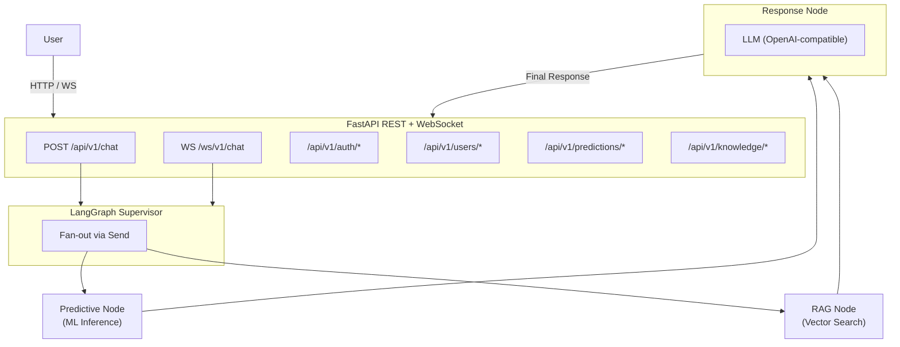

# EduLearn AI Backend

Production-ready AI backend for educational platform with FastAPI, LangGraph, RAG, and Deep Learning inference.

## Architecture



Predictive Agent (ML inference) and RAG Agent (vector search) execute **in parallel**.  
Supervisor orchestrates both via LangGraph `Send` fan-out.  
Response Agent merges outputs and generates final answer via LLM.

## Tech Stack

| Layer | Technology |
|---|---|
| API Framework | [FastAPI](https://fastapi.tiangolo.com/) (async) |
| Orchestration | [LangGraph](https://langchain-ai.github.io/langgraph/) |
| ML Inference | TensorFlow + scikit-learn pipeline |
| RAG | pgvector (PostgreSQL) |
| LLM | OpenAI-compatible API via LangChain (Flaz.id) |
| Config | pydantic-settings (env vars) |
| Database | PostgreSQL 17 + [pgvector](https://github.com/pgvector/pgvector) |
| Cache | Redis 7 |
| Container | Docker + Docker Compose |
| Proxy | Nginx (alpine) |
| Language | Python 3.12 (build) / 3.14 (runtime) |
| Package | [uv](https://github.com/astral-sh/uv) |

## Project Structure

```
server/
├── app/
│   ├── api/
│   │   ├── health.py          # GET /health
│   │   ├── chat.py            # POST /api/v1/chat
│   │   ├── chat_ws.py         # WS /ws/v1/chat + /ws/v1/health
│   │   ├── auth.py            # register / login / refresh / logout / me
│   │   ├── users.py           # GET /api/v1/users/me, /api/v1/users/stats
│   │   ├── predictions.py     # latest / history / analysis
│   │   ├── knowledge.py       # CRUD /api/v1/knowledge/*
│   │   └── deps.py            # FastAPI Depends (get_db, get_current_user)
│   ├── agent/
│   │   ├── graph.py            # LangGraph StateGraph definition + run_agent()
│   │   ├── state.py            # Agent state dataclasses
│   │   ├── supervisor.py       # Fan-out router (parallel Send)
│   │   ├── predictive_node.py  # Calls Predictor.predict()
│   │   ├── rag_node.py         # Calls Retriever.search()
│   │   ├── response_node.py    # LLM response generation
│   │   └── tools/              # Firecrawl web search tool
│   ├── machine_learning/
│   │   ├── singleton.py        # Thread-safe Singleton metaclass
│   │   └── predictor.py        # Model loader + inference
│   ├── rag/
│   │   ├── retriever.py        # RAG search interface
│   │   ├── vectorstore.py      # pgvector integration
│   │   └── ingestion.py        # Chunking + embedding pipeline
│   ├── core/
│   │   ├── config.py           # pydantic-settings (60+ env vars)
│   │   └── logging.py          # Centralized logging
│   ├── schemas/
│   │   ├── health.py           # Health response models
│   │   ├── chat.py             # Chat request/response models
│   │   ├── auth.py             # Auth request/response models
│   │   ├── prediction.py       # Prediction models
│   │   ├── knowledge.py        # Knowledge document models
│   │   └── events.py           # 12 WebSocket event types
│   ├── services/
│   │   ├── auth_service.py     # Login / register / refresh / logout
│   │   └── ...                 # Business logic layer
│   ├── db/
│   │   ├── __init__.py         # Async engine + session
│   │   ├── models/
│   │   │   ├── user.py         # User + RefreshToken
│   │   │   ├── conversation.py # Conversation + Message
│   │   │   ├── prediction.py   # PredictionHistory
│   │   │   ├── knowledge.py    # KnowledgeDocument + KnowledgeChunk
│   │   │   └── audit.py        # Audit logs
│   │   └── migrations/         # Alembic migrations
│   └── main.py                 # FastAPI entrypoint + lifespan
├── models/                     # Trained ML models (read-only)
│   ├── model.weights.h5
│   ├── pipeline.joblib
│   ├── metadata.json
│   └── config.json
├── pyproject.toml
├── uv.lock
├── Dockerfile
├── .dockerignore
└── README.md
```

## Setup

### Prerequisites

- Python 3.12+ (runtime: 3.14 in Docker, local: >=3.12 from `pyproject.toml`)
- [uv](https://github.com/astral-sh/uv) (package manager)
- Docker + Docker Compose (optional, for containerized run)

### Local Development

```bash
cd server

# Create virtual environment & install dependencies
uv sync

# Activate virtual environment
source .venv/bin/activate

# Ensure infra/.env exists (116-line template at infra/.env.example)
cp ../infra/.env.example ../infra/.env
# Edit ../infra/.env with real values (API keys, DB passwords, JWT secret)

# Run Alembic migrations
uv run alembic upgrade head

# Run server
uv run uvicorn app.main:app --reload --host 0.0.0.0 --port 8000
```

Server will be available at `http://localhost:8000`.  
API docs at `http://localhost:8000/docs` (OpenAPI) and `http://localhost:8000/redoc`.

### Docker Compose (full stack)

```bash
cd infra

# Create .env from example
cp .env.example .env
# Edit .env with real values (API keys, passwords)

# Start all services
docker compose up --build -d
```

Services:

| Service | Port |
|---|---|
| Nginx | 80 |
| Server (FastAPI) | 8000 (internal) |
| PostgreSQL | 5432 |
| Redis | 6379 |

### Environment Variables

All configuration via `../infra/.env` (template at `infra/.env.example`, 116 lines).

Key groups:

| Group | Variables | Description |
|-------|-----------|-------------|
| Database | `POSTGRES_USER`, `POSTGRES_PASSWORD`, `POSTGRES_DB`, `DATABASE_URL` | PostgreSQL + pgvector |
| Redis | `REDIS_PASSWORD`, `REDIS_URL` | Cache + rate limiting |
| LLM | `FLAZ_BASE_URL`, `FLAZ_API_KEY`, `LLM_MODEL` | OpenAI-compatible LLM |
| Auth | `JWT_SECRET`, `JWT_ALGORITHM`, `JWT_ACCESS_EXPIRE_MIN`, `JWT_REFRESH_EXPIRE_DAYS` | JWT tokens |
| ML | `MODEL_DIR`, `PREDICTION_THRESHOLD` | Model path + threshold |
| WebSocket | `WS_AUTH_REQUIRED`, `WS_CONNECTION_LIMIT_PER_USER`, `WS_RATE_MSG_PER_MIN` | WS settings |
| RAG | `EMBEDDING_MODEL`, `EMBEDDING_DIM`, `RAG_CHUNK_SIZE`, `RAG_CHUNK_OVERLAP`, `RAG_TOP_K` | RAG pipeline |
| Upload | `UPLOAD_MAX_FILE_SIZE_MB`, `UPLOAD_ALLOWED_TYPES`, `UPLOAD_DIR`, `UPLOAD_RATE_PER_DAY` | Knowledge upload |
| Firecrawl | `FIRECRAWL_API_KEY`, `FIRECRAWL_CACHE_TTL`, `FIRECRAWL_RATE_PER_CONV` | Web search tool |
| Rate Limit | `RATE_LIMIT_WINDOW_SECONDS`, `RATE_LIMIT_MAX_REQUESTS` | API rate limiting |
| CORS | `CORS_ORIGINS` | Allowed origins |

### ML Model Loading

Models are loaded **exactly once** during FastAPI startup via `lifespan`.

- `model.weights.h5` — TensorFlow Keras weights
- `pipeline.joblib` — scikit-learn preprocessing pipeline
- `metadata.json` — Model metadata
- `config.json` — Model configuration

If loading fails, the application crashes immediately (fail-fast).  
Models are **never retrained** or modified inside this repository.

## API Endpoints

### `GET /health`

Health check endpoint. Returns model status, uptime, and environment info.

### `POST /api/v1/chat`

Send a message to the AI agent (REST fallback for non-WebSocket clients).

### `WS /ws/v1/chat`

Real-time chat via WebSocket. Streams agent state updates, tool calls, tokens, citations, web results, prediction, and final response.

### Auth

| Method | Endpoint | Description |
|--------|----------|-------------|
| POST | `/api/v1/auth/register` | Register new user (name, email, password) |
| POST | `/api/v1/auth/login` | Login, returns access + refresh tokens |
| POST | `/api/v1/auth/refresh` | Refresh access token |
| POST | `/api/v1/auth/logout` | Revoke refresh tokens |
| GET | `/api/v1/auth/me` | Get current user profile |

### Users

| Method | Endpoint | Description |
|--------|----------|-------------|
| GET | `/api/v1/users/me` | Get current user (alternative) |
| GET | `/api/v1/users/stats` | Get user stats (conversations, predictions, pass rate) |

### Predictions

| Method | Endpoint | Description |
|--------|----------|-------------|
| GET | `/api/v1/predictions/latest` | Get latest prediction result |
| GET | `/api/v1/predictions/history` | Get prediction history (default 30 days) |
| GET | `/api/v1/predictions/analysis` | Aggregated analysis (pass rate, avg probability) |

### Knowledge

| Method | Endpoint | Description |
|--------|----------|-------------|
| POST | `/api/v1/knowledge/upload` | Upload document (pengajar/admin only) |
| GET | `/api/v1/knowledge` | List documents (paginated, filterable) |
| GET | `/api/v1/knowledge/{id}` | Get document details |
| DELETE | `/api/v1/knowledge/{id}` | Delete document + chunks |

## WebSocket Protocol

### Connection

```
ws://host/ws/v1/chat?token=<jwt_token>
```

Authentication via `sec-websocket-protocol: bearer.<token>` header or `token` query param.

### Client → Server Events

| Type | Fields | Description |
|------|--------|-------------|
| `ping` | `{"type": "ping"}` | Heartbeat, server replies `pong` |
| `user_message` | `{"type": "user_message", "message": "...", "conversation_id": "..."}` | Send chat message |

### Server → Client Events

| Type | Description |
|------|-------------|
| `pong` | Heartbeat response |
| `state_update` | Agent node state change (`node`, `status`, `iteration`) |
| `tool_call` | Tool invocation started (`tool_name`, `input`, `call_id`) |
| `tool_result` | Tool result (`tool_name`, `output_summary`, `duration_ms`) |
| `token` | Streaming LLM token (`content`, `index`) |
| `prediction_result` | ML prediction result (`data.label`, `data.probability`) |
| `citation` | RAG citation (`source_id`, `snippet`, `score`) |
| `web_search_result` | Firecrawl web result (`title`, `url`, `snippet`) |
| `final` | Final response (`message`, `conversation_id`, `citations`, `web_results`, `prediction_present`, `prediction_label`) |
| `error` | Error event (`message`, `fatal`) |

### Rate Limiting

- 30 messages/minute per user (configurable via `WS_RATE_MSG_PER_MIN`)
- Max 3 concurrent connections per user (`WS_CONNECTION_LIMIT_PER_USER`)
- Tool calls and token limits tracked per conversation

## LangGraph Agent Flow

```
entry point (input)
    │
    ▼
supervisor ──Send──► predictive_node (ML inference)
    │                      │
    └──Send──► rag_node (vector search)
                                  │
                                  ▼
                          response_node (LLM)
                                  │
                                  ▼
                                END
```

Both `predictive_node` and `rag_node` run **in parallel** via LangGraph `Send`.  
The supervisor does not block — both branches fan out simultaneously.

## Design Decisions

- **Singleton Predictor**: ML model loaded once at startup, reused for all requests. Thread-safe via locking.
- **Fail-fast startup**: If model loading fails, the app crashes immediately rather than serving degraded responses.
- **Independent layers**: ML layer has no knowledge of LangGraph. RAG layer has no knowledge of LangGraph. LangGraph only orchestrates.
- **Environment-driven config**: Zero hardcoded values. pydantic-settings reads from `infra/.env`.
- **OpenAI-compatible LLM**: Any provider with OpenAI-compatible API works via `base_url` configuration.

## Docker

The `Dockerfile` uses multi-stage builds with `uv` for fast dependency installation.

- Model directory `/app/models` is mounted as **read-only volume**
- Runs as non-root `appuser`
- Includes Docker `HEALTHCHECK` against `/health`
- Memory limit: 2G in docker-compose

## Security

- API keys and passwords are never exposed to clients
- Stack traces are never returned in API responses
- All exceptions are logged server-side with `HTTPException` for user-facing errors
- ML model directory is read-only
- WebSocket events sanitized via `EventSanitizer` (redacts paths, keys, system prompts)

## Database Schema

### `users`

| Column | Type | Notes |
|--------|------|-------|
| `id` | UUID | PK, auto-generated |
| `name` | VARCHAR(200) | |
| `email` | VARCHAR(255) | Unique, indexed |
| `password_hash` | VARCHAR(255) | Argon2/bcrypt |
| `role` | VARCHAR(20) | `siswa`, `pengajar`, `admin` |
| `created_at` | TIMESTAMPTZ | |
| `updated_at` | TIMESTAMPTZ | |

### `conversations`

| Column | Type | Notes |
|--------|------|-------|
| `id` | UUID | PK |
| `user_id` | UUID | FK → users |
| `title` | VARCHAR(255) | nullable |
| `status` | VARCHAR(20) | `active`, `archived` |
| `total_iterations` / `total_tokens_used` / `total_tool_calls` / `total_citations` / `total_web_results` | INT | Usage tracking |
| `prediction_label` | VARCHAR(20) | nullable |
| `firecrawl_cost` | FLOAT | |

### `messages`

| Column | Type | Notes |
|--------|------|-------|
| `id` | UUID | PK |
| `conversation_id` | UUID | FK → conversations |
| `sequence` | INT | Unique per conversation |
| `role` | VARCHAR(20) | `user`, `assistant`, `tool` |
| `content` | TEXT | |
| `tool_name` / `tool_input` / `tool_duration_ms` | JSON/INT | Tool tracking |
| `token_count` | INT | nullable |

### `prediction_histories`

| Column | Type | Notes |
|--------|------|-------|
| `id` | UUID | PK |
| `user_id` | UUID | FK → users |
| `conversation_id` | UUID | FK → conversations (nullable) |
| `predicted_label` | VARCHAR(20) | `Lulus` / `Tidak Lulus` |
| `confidence` | FLOAT | 0.0 – 1.0 |
| `class_scores` | JSONB | Full score breakdown |
| `input_features_snapshot` | JSONB | Feature values at prediction time |

### `knowledge_documents`

| Column | Type | Notes |
|--------|------|-------|
| `id` | UUID | PK |
| `file_name` / `file_type` / `file_size_bytes` | VARCHAR/BIGINT | File metadata |
| `title` / `author` / `description` | VARCHAR/TEXT | |
| `tags` | ARRAY(VARCHAR) | |
| `total_chunks` | INT | |
| `uploaded_by` | UUID | FK → users |
| `status` | VARCHAR(20) | `processing`, `ready`, `failed` |

### `knowledge_chunks`

| Column | Type | Notes |
|--------|------|-------|
| `id` | UUID | PK |
| `document_id` | UUID | FK → knowledge_documents |
| `chunk_index` | INT | |
| `content` | TEXT | Chunk text |
| `embedding` | VECTOR(1536) | pgvector embedding |
| `extra_metadata` | JSONB | |

## Testing

```bash
cd server

# Run all tests
uv run pytest

# Run with coverage
uv run pytest --cov=app --cov-report=term-missing

# Run specific test file
uv run pytest tests/test_chat.py -v
```

> **Note:** Tests located in `server/tests/` (excluded from Docker image via `.dockerignore`).

## Development

### Adding new API routes

1. Create router in `app/api/<name>.py`
2. Register in `app/main.py` via `app.include_router()`

### Adding new agent nodes

1. Create node function in `app/agent/<name>_node.py`
2. Add node to `app/agent/graph.py`
3. Wire edges in `create_graph()`

### Code style

- Type hints everywhere
- Pydantic v2 for all schemas
- Async I/O (except ML inference which is CPU-bound)
- SOLID principles + Clean Architecture
- No `global` keyword
